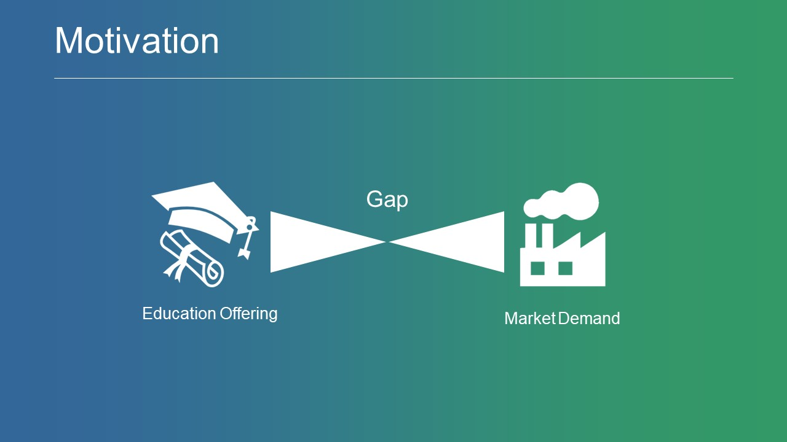
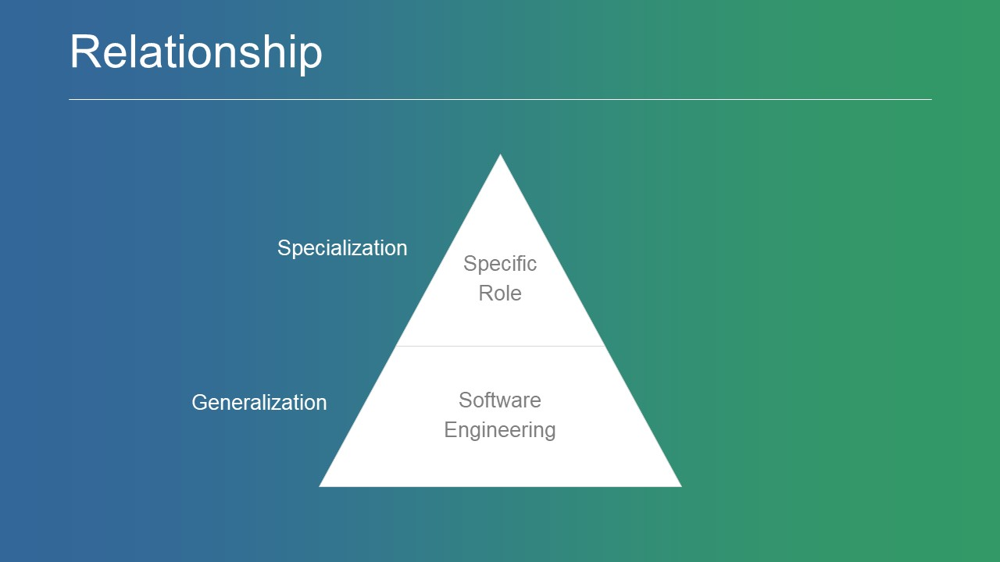
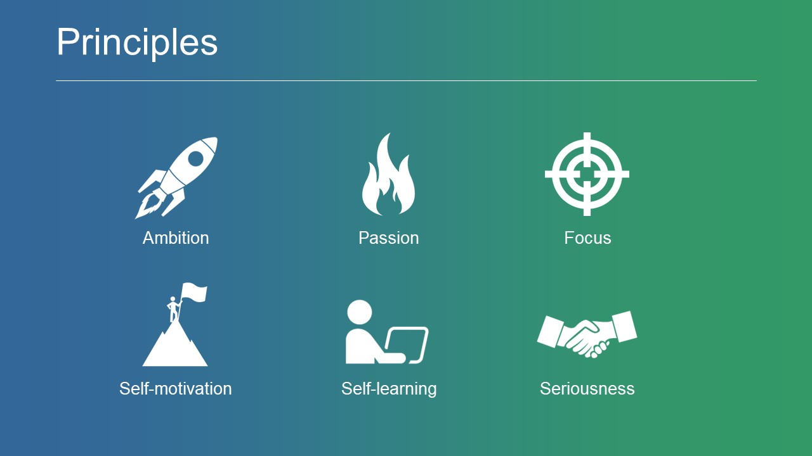
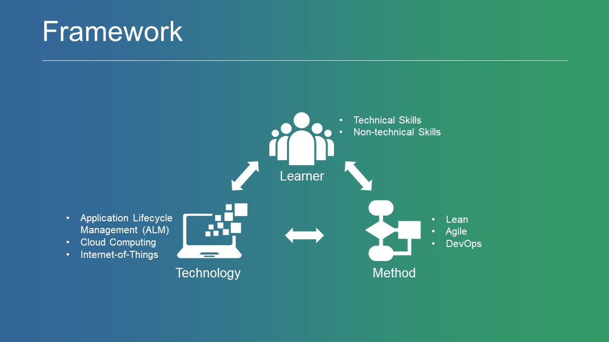
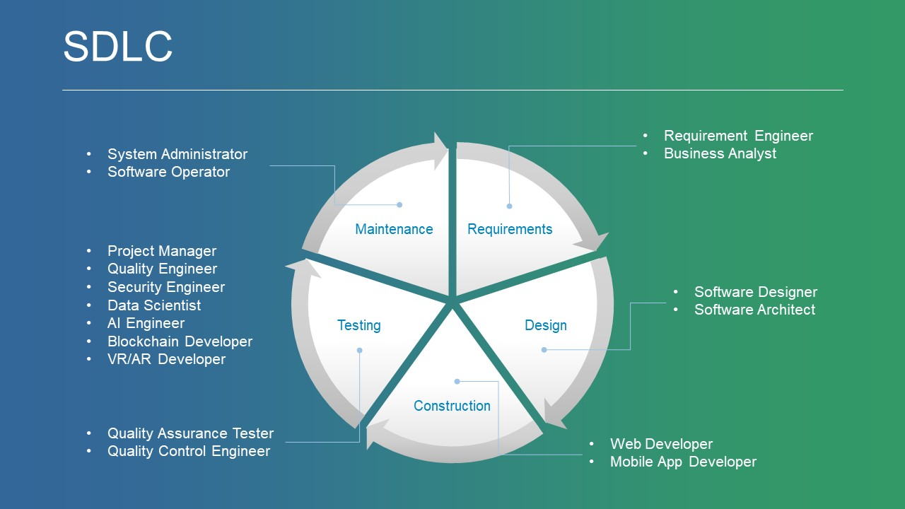
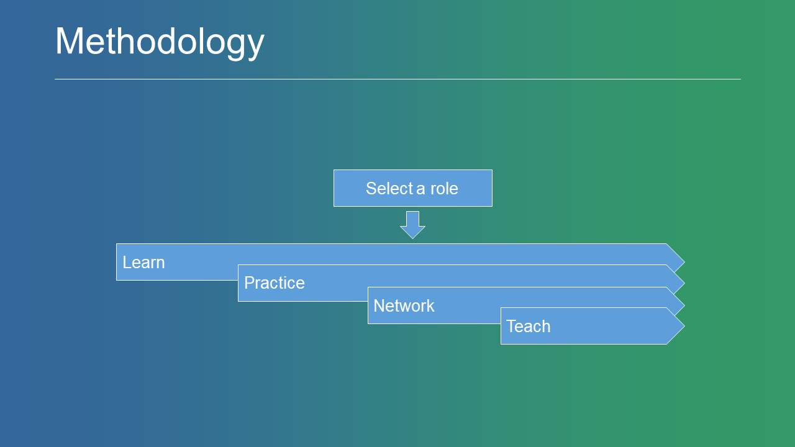
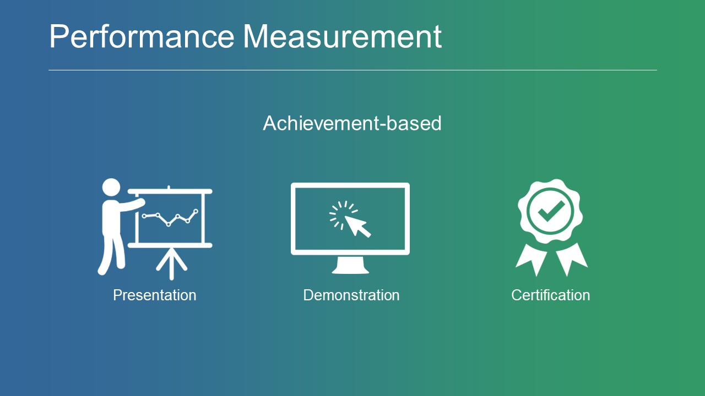

## Welcome to Software Engineering Guide

**Software Engineering Guide (SEG)** is a self-learning roadmap with a curated list of high-quality and free-of-cost learning resources in the software engineering domain. SEG is a role-based guide that is organized into specialized learning paths. SEG covers the entire software development lifecycle (SDLC) knowledge domains that represent the most popular working roles related to software engineering. Each learning path has an overview section and a set of structured online learning resources that are organized into four levels: foundation, beginner, intermediate, and advanced. Each level has a variety of online learning resources that are categorized into three types: MOOCs, webinars, and others. These learning resources are collected from highly-respected and well-trusted sources.

### Motivation

The motivation behind building this guide is the existing gap between the knowledge and skills that are acquired from traditional education offerings and the ones that are demanded today by industry--particularly at the places with low-quality education. However, nowadays, with the availability and affordability of internet connectivity, you can easily gain free-of-cost access to high-quality learning resources from around the world. *Therefore, there is no excuse to say that I don't have a quality education!*

### Relationship

Software engineering is a broad field that encompasses so many different sub-specializations and interrelates to many other computing fields, such as computer science and computer engineering. Therefore, to be a professional in software engineering, you need to have a foundational background on software engineering and its related fields. Furthermore, you need to choose and master a sub-specialization in software engineering (role-based).    

 

### Principles

To be a professional in software engineering, you have to guide yourself by adopting some important principles, including purpose, ambition, passion, focus, self-motivation, self-learning, seriousness, and patience. Without such principles, it would be very difficult to be in a mastery level of software engineering.

 

### Framework

The SEG is inspired by a framework that combines three essential components to master software engineering, including learner (acquiring technical and non-technical skills), methodology (adopting lean, agile, and DevOps), and technology (using next-generation technologies, such as ALM, IoT, cloud computing, etc.).

 

### Knowledge Areas

The SEG is mainly developed based on the main knowledge areas of the software development lifecycle (SDLC) included in the Software Engineering Body of Knowledge ([SWEBOK V3](https://www.computer.org/web/swebok/v3)). Each knowledge area can be mapped to a career path in the industry. Furthermore, there are cross-knowledge areas and emerging career paths, such as data scientist and artificial intelligence engineer.

 

### Learning Paths

The SEG currently includes 12 different role-based learning paths (specializations). SEG provides guiding information and learning resources for each learning path. If you don't know which learning path to go with! you can identify your potential career by using the [IBM IT Assessment](https://www.coursera.org/learn/ibm-it-assessment).

**Traditional Roles:**

- [Software Requirements Engineer](swr.md)
- [Software Designer](swd.md)
- [Software Programmer](swc.md)
- [Software Tester](swt.md)
- [Software Administrator](swm.md)
- [Software Quality Engineer](swq.md)
- [Software Security Engineer](sws.md)
- [Software Project Manager](swem.md)

**Emerging Roles:**

- [Data Scientist](ds.md)
- [Artificial Intelligence Engineer](ai.md)
- [Blockchain Developer](bc.md)
- [Virtual and Augmented Reality Developer](var.md)

### Interpersonal Skills

Technical skills are not enough to be a professional in software engineering! In today's competitive working environments, soft skills are imperative and not less important than technical skills. Furthermore, developing a new business or establishing a tech start-up needs an additional type of skill-set in entrepreneurship.

- [Soft Skills](ss.md)
- [Entrepreneurship Skills](es.md)

### Learning Process

To get full advantage of this guide, it is highly recommended to first select a role from the specialized learning paths listed above. Then, begin the following self-development process: learning, practicing, networking, and teaching. These steps are overlapped, iterative, and should be a life-long journey.

 

- **Learning**: a self-learning process to increase the learner's knowledge based on available online resources. The learner can leverage the collected resources available in this guide for each specialized role. These collections contain up-to-date, high-quality, and free-of-cost online learning resources.

- **Practicing**: using software tools and technologies to improve the learner's practical skills. The learner can utilize open source and free software tools. The learner can also gain trial access to some commercial software tools to apply the acquired theoretical knowledge.

- **Networking**: joining and connecting with professional and specialized online communities. This allows the learner to keep updated with the latest trends and technologies in a selected learning path. Furthermore, networking provides a medium for asking questions and getting help in resolving encountered issues.

- **Teaching**: this process helps in keeping the learner more focused and connected with others through knowledge sharing and open discussions. In addition, teaching can help in sharpening the learner's soft skills like confidence, communication, presentation, speaking, etc.

### Learning Outcomes

| Level        | Description           | Outcome  |
| ------------- |:-------------| :-----|
| **Foundation**     | Explains how to learn and provides an overall background in software engineering | Understanding the importance of self-learning and the basics of software engineering|
| **Beginner**     | Focuses on basic knowledge and skills of a particular learning path | Understanding the fundamentals of the selected learning path |
| **Intermediate** | Focuses on agile approaches and application life-cycle management software (ALM) | The ability to develop prototypes using an agile approach and ALM software |
| **Advanced** | Focuses on next-generation technologies (e.g. internet-of-things and cloud computing) and approaches (e.g. DevOps)      |    The ability to develop next-generation applications using cloud computing and DevOps approach |

### Performance Measurement

It is very important for any professional in software engineering to measure his/her learning progress towards learning objectives and future career path. From a practical perspective, this can be achieved by different means (achievement-based), such as delivering a technical presentation, demonstrating a piece of a developed prototype or a fully functioning application, or acquiring a professional certification in a particular domain.

 

### Follow Us

 

