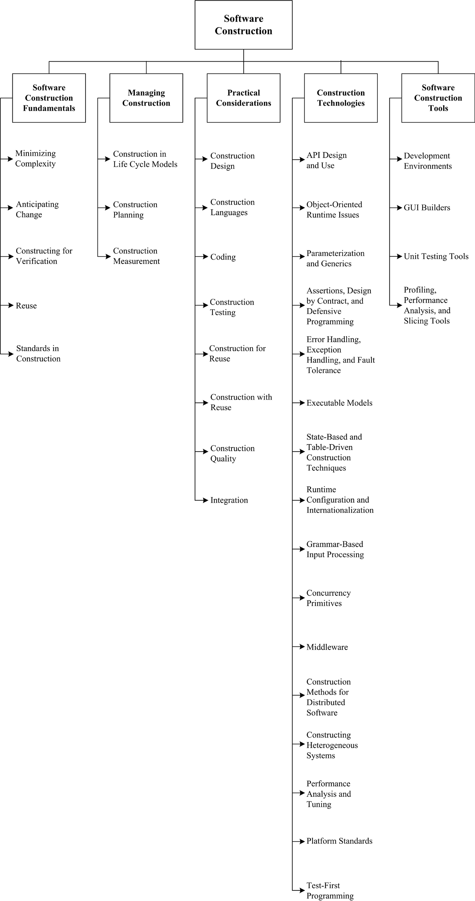

[Home](index.md)
## Welcome to Software Construction

The term software construction refers to the detailed creation of working software through a combination of coding, verification, unit testing, integration testing, and debugging. The Software Construction is most strongly linked to Software Design and Software Testing because the software construction process involves significant software design and testing. The process uses the design output and provides an input to testing. Boundaries between design, construction, and testing (if any) will vary depending on the software life cycle processes that are used in a project.

Although some detailed design may be performed prior to construction, much design work is performed during the construction activity. Thus, the Software Construction is closely linked to the Software Design . Throughout construction, software engineers both unit test and integration test their work. Thus, the Software Construction is closely linked to the Software Testing as well.

Software construction typically produces the highest number of configuration items that need to be managed in a software project (source files, documentation, test cases, and so on). Thus, the Software Construction is also closely linked to the Software Configuration Management. Code is the ultimate deliverable of a software project, and thus the Software Quality is closely linked to the Software Construction.

Since software construction requires knowledge of algorithms and of coding practices, it is closely related to the Computing Foundations, which is concerned with the computer science foundations that support the design and construction of software products. It is also related to project management, insofar as the management of construction can present considerable challenges.

*Source: [SWEBOK V3](https://www.computer.org/web/swebok/v3)*

### Knowledge and Skills

*Source: [SWEBOK V3](https://www.computer.org/web/swebok/v3)*

### Possible Roles

- [Computer Programmer](https://www.sokanu.com/careers/computer-programmer/)
- [Web Developer](https://www.sokanu.com/careers/web-developer/)
- [Mobile Apps Developer](https://www.sokanu.com/careers/app-developer/)

### How To

- [Want to become a Software Developer?](https://hackernoon.com/want-to-become-a-software-developer-heres-how-to-get-there-55f393aa443c)
- [How to Become a Web Developer](https://sf.tradepub.com/free-offer/how-to-become-a-web-developer/w_webd08)
- [How to Become a Mobile App Developer](https://buildfire.com/become-mobile-app-developer/)
- [Roadmap to becoming a web developer](https://github.com/kamranahmedse/developer-roadmap)
- [A Guide to Becoming a Full-Stack Developer in 2017](https://medium.com/coderbyte/a-guide-to-becoming-a-full-stack-developer-in-2017-5c3c08a1600c)

### Professional Certifications

- [CompTIA Career Roadmap](https://certification.comptia.org/why-certify/roadmap)
- [14 developer certifications that will give you an edge](https://www.pluralsight.com/blog/software-development/best-developer-certifications)
- [Best Computer Programming Certifications For 2017](http://www.tomsitpro.com/articles/programming-certifications,2-274.html)
- [Programming and Developer Certifications](http://certification.about.com/cs/beginner/a/progcerts.htm)

### Community of Interest

- [Top 10 Sites to Ask All Your Programming Questions](http://www.hongkiat.com/blog/programming-questions-websites/)
- [14 Programming Communities for Developers, Hackers](http://codecondo.com/programming-communities/)
- [Awesome Community](https://github.com/php-earth/awesome-community)
- LinkedIn Groups:
  - [Software Programmers](https://www.linkedin.com/groups/10324839)
  - [Software Developer](https://www.linkedin.com/groups/1074487/profile)
  - [Mobile Application Developers Connections](https://www.linkedin.com/groups/4297440/profile)

### Blogs

- [Medium - Programming](https://medium.com/topic/programming)
- [O'Reilly - Web Programming](https://www.oreilly.com/topics/web-programming)
- [TechBeacon - App Dev](https://techbeacon.com/app-dev)
- [Techbeacon - Mobile](https://techbeacon.com/mobile)
- [Top 50 Software Development Blogs & Websites For Software Developers](http://blog.feedspot.com/software_development_blogs/)
- [Top 50 Programming Blogs & Websites Every Programmer Must Follow](http://blog.feedspot.com/programming_blogs/)
- [Best Web Development & Programming Blogs for 2017](https://www.codementor.io/codementorteam/best-programming-blogs-web-development-blogs-2017-quclkir3s)

### Market Insights

- [Software Developer](https://www.linkedin.com/title/software-developer)
- [Web Developer](https://www.linkedin.com/title/web-developer)
- [Mobile Developer](https://www.linkedin.com/title/mobile-developer)
- [Software Programmer](https://www.linkedin.com/title/software-programmer)
- [Software Development](https://www.linkedin.com/topic/software-development)
- [Programming](https://www.linkedin.com/topic/programming)

### Resources Collections

- [22 Places to Learn to Code for Free in 2017](https://makeawebsitehub.com/learn-to-code-for-free/)
- [45 of The Best Places to Learn to Code For Free](http://learntocodewith.me/posts/code-for-free/)
- [The Top 66 Developer Resources From 2017](https://hackernoon.com/the-top-66-developer-resources-from-2017-e82531365e6d)
- [67 useful tools, libraries and resources for saving your time as a web developer](https://hackernoon.com/67-useful-tools-libraries-and-resources-for-saving-your-time-as-a-web-developer-7d3fb8667030)
- [100+ Free resources for learning Full Stack Web Development](https://github.com/bmorelli25/Become-A-Full-Stack-Web-Developer)
- [Best Websites a Programmer Should Visit](https://github.com/sdmg15/Best-websites-a-programmer-should-visit/blob/master/README.md)
- [Resources to find, interview, and hire freelance developers](https://www.toptal.com/resources)

## Learning Resources

**Important Note:** *all learning resources available here are free. If you found any learning resource that requires a fee or the URL is broken/wrong, please [inform us](https://github.com/ayshahrah/seg/issues). Regarding the MOOCs that are bundled as a specialization track with a fee (e.g. coursera's specializations and edx's xseries programs), you can look for each individual course and take it for free (Audit option).*

### Foundation

#### MOOCs

- [Learning How to Learn](https://www.coursera.org/learn/learning-how-to-learn)
- [Mindshift](https://www.coursera.org/learn/mindshift)
- [Software Development Process](https://www.udacity.com/course/software-development-process--ud805)
- [Software Engineering Essentials](https://www.edx.org/course/software-engineering-essentials-tumx-seecx-0)
- [Software Engineering: Introduction](https://www.edx.org/course/software-engineering-introduction-ubcx-softeng1x)
- **[Soft Skills](ss.md)**

#### Webinars

- [Seven Secrets to Starting a Successful Programming Career](https://www.youtube.com/watch?v=dhb1n9zua2I)
- [Future and Career Opportunities For A Full Stack Developer](https://www.youtube.com/watch?v=KD0M9azH6dE)
- [Rethinking the Developer Career Path](https://www.youtube.com/watch?v=yIPbE7BssOs)
- [How to Become a Full Stack Web Developer](https://www.youtube.com/watch?v=X-HevVfZ2dw)
- [Web Development in 2018](https://www.youtube.com/watch?v=Zftx68K-1D4)

#### Others

- Read the Chapter 3: Software Construction in [SWEBOK V3](https://www.computer.org/web/swebok/v3)
- [What Code Should You Learn?](http://www.whoishostingthis.com/blog/2014/09/04/learn-to-code/)
- [Learn to Code: What’s the Best Programming Language to Learn First?](https://makeawebsitehub.com/which-programming-language/)
- [Best Programming Languages to Start Learning Today](https://www.simplilearn.com/best-programming-languages-start-learning-today-article)
- [The Best Web Programming Languages to Learn](https://sf.tradepub.com/free-offer/the-best-web-programming-languages-to-learn/w_webd10)
- [Abilities that makes you a better developer](https://hackernoon.com/abilities-that-makes-you-a-better-developer-82295c75de59)

### Beginner

#### MOOCs

- [Udacity: Imagine your future!](https://www.udacity.com/pathfinder)
- [Computer Science - coursera](https://www.coursera.org/browse/computer-science?languages=en)
- [Computer Science - edx](https://www.edx.org/course/subject/computer-science)
- [Computer programming - khan academy](https://www.khanacademy.org/computing/computer-programming)
- [Microsoft Virtual Academy](https://mva.microsoft.com/)

#### Webinars

- [How to Program](https://www.youtube.com/watch?v=KNjiKbSSlCM)
- [Mobile Application Development - The Full Lifecycle](http://www.disys.com/webinar-mobile-application-development/)
- [Mobile Application Development—Demystified](http://www.telerik.com/webinars/appbuilder/mobile-application-development-demystified)
- [Programming Webinars](http://www.webagesolutions.com/webinars/categories/programming.html)

#### Others

- [O’Reilly Free Programming Ebooks](http://www.oreilly.com/programming/free/)
- [O’Reilly Free Web Development & Performance Ebooks](http://www.oreilly.com/web-platform/free/)
- [O’Reilly Free Hardware and IoT Ebooks](http://www.oreilly.com/iot/free/)
- [O’Reilly Free Free Web Ops & DevOps Ebooks](http://www.oreilly.com/webops/free/)
- [Beginner’s Guide to Web Development](https://www.codeschool.com/beginners-guide-to-web-development)
- [Learn How to Develop the Next Generation of Applications for the Web](https://developers.google.com/web/)
- [Make A Website Hub](https://makeawebsitehub.com/resources/)
- [The Software Engineer's Online Handbook](https://www.toptal.com/handbook#online-tools)
- [free-programming-books](https://github.com/vhf/free-programming-books)
- [Toptal's List of Top Free Programming Books](https://www.toptal.com/software/toptal-s-list-of-top-free-programming-books)
- [9 Free Programming Books That Will Make You A Pro](http://www.makeuseof.com/tag/9-free-programming-books-will-make-pro/)
- [100 Best Free Programming Books](http://devzum.com/2015/02/100-best-free-programming-books/)
- [Getting Started with Open Source development](https://bigdatauniversity.com/resources/getting-started-with-open-source-development/)

### Intermediate

#### MOOCs

- [Software Development Lifecycle](https://www.coursera.org/specializations/software-development-lifecycle)
- [Agile Development](https://www.coursera.org/specializations/agile-development)
- [Agile Software Development](https://www.edx.org/course/agile-software-development-ethx-asd-1x)
- [GitHub & Collaboration](https://www.udacity.com/course/github-collaboration--ud456)

#### Webinars

- [Agile Development Basics](http://info.versionone.com/Agile-Development-Basics-Webinar.html)
- [Better, Faster, and Easier: Agile Application Development for Your Business](http://www.appian.com/resources/better-faster-and-easier-agile-application-development-for-your-business/)
- [Watch the Do Agile Right webinar](http://blogs.atlassian.com/2014/02/watch-agile-right-webinar-lessons-learned-atlassian-software-engineer/)

#### Others

- [Agile for Dummies](https://www-01.ibm.com/marketing/iwm/dre/signup?source=mrs-form-334&S_PKG=ov3282)
- [Agile Skills Learning Circle Wiki](https://www.ibm.com/developerworks/community/wikis/home/wiki/W61b873bae705_4dcd_aa9b_fe8380d4d7fb?lang=en)
- [Agile Methodology](https://www.cigital.com/knowledge-database/agile-methodology/)
- [Agile Alliance](https://www.agilealliance.org/)
- [The Agile Coach](https://www.atlassian.com/agile)
- [Getting Started or Simply Scaling Agile?](https://www.versionone.com/resources/)
- [A Practical Guide: Product Management & Agile Development](http://web.accompa.com/white-paper-product-management-agile-development/)
- [Agile Android Software Development](https://www.agiledroid.com/)
- [AgileConnection.com](https://www.agileconnection.com/)
- [Scrum Guide](http://www.scrumguides.org/)
- [CMCrossroads.com](https://www.cmcrossroads.com/)
- [ALM Body of Knowledge](http://www.almbok.com/start)
- [Application lifecycle management tools: A buyer's guide to ALM software](http://searchsoftwarequality.techtarget.com/buyersguide/Application-lifecycle-management-tools-A-buyers-guide-to-ALM-software)
- [Software Development Trends and Benchmarks](https://www.atlassian.com/whitepapers/software-trends-2016)

### Advanced

#### MOOCs

- [Industry 4.0: How to Revolutionize your Business](https://www.edx.org/course/industry-4-0-how-revolutionize-business-hkpolyux-i4-0x)
- [Emerging Technologies: From Smartphones to IoT to Big Data Specialization](https://www.coursera.org/specializations/emerging-technologies)
- [Internet of Things](https://www.coursera.org/specializations/internet-of-things)
- [The Internet of Things](https://www.futurelearn.com/courses/internet-of-things)
- [An Introduction to Programming the Internet of Things (IOT)](https://www.coursera.org/specializations/iot)
- [A developer's guide to the Internet of Things (IoT)](https://www.coursera.org/learn/developer-iot)
- [Unpacking the Internet of Things (IoT)](https://www.udemy.com/unpacking-the-internet-of-things/)
- [A Simple Framework for Designing IoT Products](https://www.udemy.com/a-simple-framework-for-designing-iot-products/)
- [New Business Markets in the Internet of Things (IoT)](https://www.udemy.com/new-business-markets-in-iot/)
- [Cloud Computing](https://www.coursera.org/specializations/cloud-computing)
- [Intro to DevOps](https://www.udacity.com/course/intro-to-devops--ud611)
- [DevOps: An IT Pro Guide](https://mva.microsoft.com/en-us/training-courses/devops-an-it-pro-guide-8286)
- **[Entrepreneurship Skills](es.md)**

#### Webinars

- [Modern Application Development Life Cycle Management](https://www.gartner.com/webinar/2998618)
- [Introducing the Next Generation of ALM](https://www.brighttalk.com/webcast/8653/197515)
- [Skytap On-Demand Webinars](https://www.skytap.com/research-center/on-demand-webinars/)
- [GOTO Conferences](https://www.youtube.com/user/GotoConferences)
- [VersionOne Webinars](https://www.versionone.com/resources/webinars/)
- [Internet of Things Webinar Series](https://www.mongodb.com/lp/webinar-series/internet-of-things)
- [Ayla Webinars](https://www.aylanetworks.com/newsroom/events)

#### Others

- [Internet of Things: A Developer's Mandate](https://www.appdevelopersalliance.org/internet-of-things/)
- [Industrial Internet App Development](http://go.digital.ge.com/Evans-Data-Survey-Results.html)
- [7 Best Developer Tools to Build your Next Internet of Things Application](https://www.losant.com/blog/7-best-developer-tools-to-build-your-next-internet-of-things-application)
- [67 open source tools and resources for IoT](https://techbeacon.com/67-open-source-tools-resources-iot)
- [APIs for Dummies](https://www-01.ibm.com/marketing/iwm/iwm/web/signup.do?source=sw-app&S_PKG=ov29766&dynform=13182)
- [API University](https://www.programmableweb.com/api-university)
- [DevOps For Dummies](http://www.ibm.com/ibm/devops/us/en/resources/dummiesbooks/)
- [The Ultimate DevOps Toolkit](https://www.appdynamics.com/lp/devops-toolkit/)
- [DevOps.com](https://devops.com/)
- [Roles and Responsibilities for DevOps and Agile Teams](https://medium.com/@cote/roles-and-responsibilities-for-devops-and-agile-teams-fdacbffb4cb4#.9de94n71e)
- [XebiaLabs Resource Library](https://xebialabs.com/resources/)
- [Scaled Agile Framework (SAFe®) in a nutshell](https://intland.com/blog/agile/safe/scaled-agile-framework-safe-in-a-nutshell/)
- [Doing Scrum with Multiple Teams: Comparing Scaling Frameworks](https://www.infoq.com/articles/scrum-multiple-teams-frameworks)
- [TechBeacon](https://techbeacon.com/)
- [TradePub.com](https://sf.tradepub.com/)
