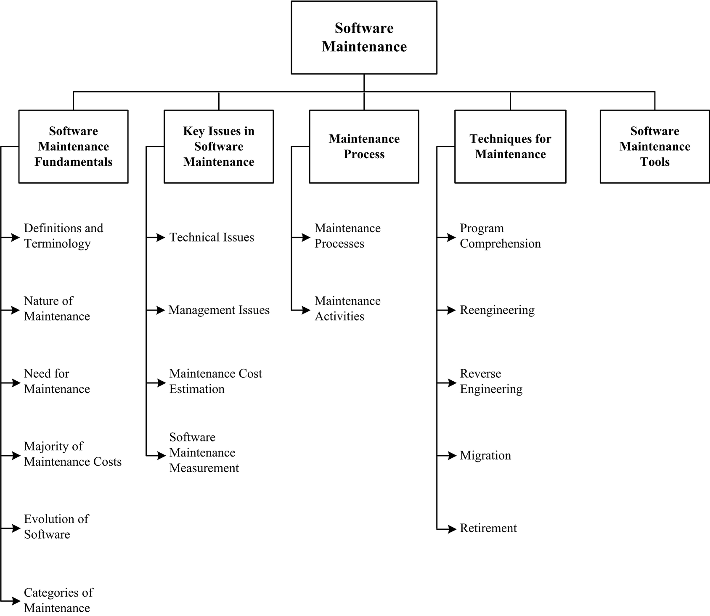

[Home](index.md)
## Welcome to Software Maintenance

Software development efforts result in the delivery of a software product that satisfies user requirements. Accordingly, the software product must change or evolve. Once in operation, defects are uncovered, operating environments change, and new user requirements surface. The maintenance phase of the life cycle begins following a warranty period or postimplementation support delivery, but maintenance activities occur much earlier.

Software maintenance is an integral part of a software life cycle. However, it has not received the same degree of attention that the other phases have. Historically, software development has had a much higher profile than software maintenance in most organizations. This is now changing, as organizations strive to squeeze the most out of their software development investment by keeping software operating as long as possible. The open source paradigm has brought further attention to the issue of maintaining software artifacts developed by others.

Software maintenance is defined as the totality of activities required to provide cost-effective support to software. Activities are performed during the predelivery stage as well as during the postdelivery stage. Predelivery activities include planning for postdelivery operations, maintainability, and logistics determination for transition activities. Postdelivery activities include software modification, training, and operating or interfacing to a help desk.

*Source: [SWEBOK V3](https://www.computer.org/web/swebok/v3)*

### Knowledge and Skills

*Source: [SWEBOK V3](https://www.computer.org/web/swebok/v3)*

### Possible Roles

- [Computer Systems Administrator](https://www.sokanu.com/careers/computer-systems-administrator/)
- [Server Administrator](https://www.sokanu.com/careers/server-administrator/)
- [Technical Support Specialist](https://www.sokanu.com/careers/technical-support-specialist/)

### How To

- [The Essential Guide to Becoming a Systems Administrator](https://www.paysa.com/blog/2016/12/05/the-essential-guide-to-becoming-a-systems-administrator/)
- [Want to Become a Systems Engineer?](https://www.roberthalf.com/blog/salaries-and-skills/want-to-become-a-systems-engineer-here-are-the-skills-required)
- [7 Steps to Start Your Linux SysAdmin Career](https://www.linuxfoundation.org/blog/7-steps-to-start-your-linux-sysadmin-career/)

### Professional Certifications

- [Best System Administrator Certifications For 2017](http://www.tomsitpro.com/articles/system-administrator-certifications,2-632.html)
- [CompTIA Career Roadmap](https://certification.comptia.org/why-certify/roadmap#.WEbilLmJITw.linkedin)

### Community of Interest

- [League of Professional System Administrators (LOPSA)](https://lopsa.org/)
- [LinkedIn - System Administrator](https://www.linkedin.com/groups/51443/)

### Blogs

- [O'Reilly - Operations](https://www.oreilly.com/topics/operations)
- [TechBeacon - IT Ops](https://techbeacon.com/it-ops)
- [Flexera Software Blogs](http://blogs.flexerasoftware.com/)
- [The Agile Admin](https://theagileadmin.com/)
- [Top 30 Cloud Computing Blogs For Latest Cloud Technology News](http://blog.feedspot.com/cloud_computing_blogs/)
- [Best Blogs Every Linux SysAdmin Must Follow](https://itsfoss.com/best-sysadmin-blogs/)

### Market Insights

- [System Administration](https://www.linkedin.com/topic/system-administration)
- [Administrator](https://www.linkedin.com/title/administrator)
- [Software Administration](https://www.linkedin.com/topic/software-administration)

### Resources Collections

- [Top 10 resources for System Administrators](https://www.getfilecloud.com/blog/top-10-resources-for-system-administrators/)
- [10 Free Online Resources for Learning Linux](https://beebom.com/free-online-resources-learning-linux/)
- [12 Resources to Learn Linux Administration](https://medium.com/@abhi.eduonix/12-resources-to-learn-linux-administration-c432e024af73)

## Learning Resources

**Important Note:** *all learning resources available here are free. If you found any learning resource that requires a fee or the URL is broken/wrong, please [inform us](https://github.com/ayshahrah/seg/issues). Regarding the MOOCs that are bundled as a specialization track with a fee (e.g. coursera's specializations and edx's xseries programs), you can look for each individual course and take it for free (Audit option).*

### Foundation

#### MOOCs

- [Learning How to Learn](https://www.coursera.org/learn/learning-how-to-learn)
- [Mindshift](https://www.coursera.org/learn/mindshift)
- [Software Development Process](https://www.udacity.com/course/software-development-process--ud805)
- [Software Engineering Essentials](https://www.edx.org/course/software-engineering-essentials-tumx-seecx-0)
- [Software Engineering: Introduction](https://www.edx.org/course/software-engineering-introduction-ubcx-softeng1x)
- **[Soft Skills](ss.md)**

#### Webinars

- [A day in the Life of a Linux Administrator](https://www.youtube.com/watch?v=zvoBWbQ6a7U)
- [The System Administrator Role in the Cloud Era: Better Than Ever](https://www.youtube.com/watch?v=1LRSS29SH44)

#### Others

- Read the Chapter 5: Software Maintenance in [SWEBOK V3](https://www.computer.org/web/swebok/v3)

### Beginner

#### MOOCs

- [Google IT Support](https://www.coursera.org/specializations/google-it-support)
- [Microsoft Professional Program - IT Support](https://academy.microsoft.com/en-us/professional-program/tracks/it-support/)
- [Computer Security and Systems Management](https://www.coursera.org/specializations/computer-security-systems-management)
- [Introduction to Data Storage and Management Technologies](https://www.edx.org/course/introduction-data-storage-management-ieeex-storage101x-0)
- [Systems Administration Courses](https://www.cybrary.it/systems-administration/)
- [Configuring Linux Web Servers](https://www.udacity.com/course/configuring-linux-web-servers--ud299)
- [Introduction to Linux](https://www.edx.org/course/introduction-linux-linuxfoundationx-lfs101x-0)
- [Fundamentals of Red Hat Enterprise Linux](https://www.edx.org/course/fundamentals-red-hat-enterprise-linux-red-hat-rh066x)
- [Windows Server Courses](https://www.edx.org/school/microsoft)
- [Microsoft Virtual Academy](https://mva.microsoft.com/)

#### Webinars

- [Linux Training Webinars](https://training.linuxfoundation.org/free-linux-training/linux-training-videos#webinar)
- [Understanding the Windows Server Administration Fundamentals](https://www.youtube.com/watch?v=937fFFLC8pk)

#### Others

- [Introduction to Linux - A Hands on Guide](http://sf.tradepub.com/free/w_mach01/)
- [Linux Tutorials For System Administrators](https://training.linuxfoundation.org/free-linux-training/linux-training-videos#sysadmin)
- [Linux System Administration Tutorials and Courses](https://hackr.io/tutorials/learn-system-administration)
- [Free Linux Training Online](https://training.linuxfoundation.org/free-linux-training)
- [10 Useful Free Linux eBooks for Newbies and Administrators](http://www.tecmint.com/10-useful-free-linux-ebooks-for-newbies-and-administrators/)
- [Free eBooks from Microsoft Press](https://mva.microsoft.com/ebooks)
- [Free eBooks for Windows administrators](https://4sysops.com/archives/free-e-books-for-windows-administrators/)

### Intermediate

#### MOOCs

- [Software Development Lifecycle](https://www.coursera.org/specializations/software-development-lifecycle)
- [Agile Development](https://www.coursera.org/specializations/agile-development)
- [Agile Software Development](https://www.edx.org/course/agile-software-development-ethx-asd-1x)
- [Software Product Management](https://www.coursera.org/specializations/product-management)

#### Webinars

- [Agile Development Basics](http://info.versionone.com/Agile-Development-Basics-Webinar.html)
- [Better, Faster, and Easier: Agile Application Development for Your Business](http://www.appian.com/resources/better-faster-and-easier-agile-application-development-for-your-business/)
- [Watch the Do Agile Right webinar](http://blogs.atlassian.com/2014/02/watch-agile-right-webinar-lessons-learned-atlassian-software-engineer/)

#### Others

- [Agile for Dummies](https://www-01.ibm.com/marketing/iwm/dre/signup?source=mrs-form-334&S_PKG=ov3282)
- [Agile Skills Learning Circle Wiki](https://www.ibm.com/developerworks/community/wikis/home/wiki/W61b873bae705_4dcd_aa9b_fe8380d4d7fb?lang=en)
- [Agile Methodology](https://www.cigital.com/knowledge-database/agile-methodology/)
- [Agile Alliance](https://www.agilealliance.org/)
- [The Agile Coach](https://www.atlassian.com/agile)
- [Getting Started or Simply Scaling Agile?](https://www.versionone.com/resources/)
- [A Practical Guide: Product Management & Agile Development](http://web.accompa.com/white-paper-product-management-agile-development/)
- [Agile processes for the maintenance cycle](http://www.ibm.com/developerworks/rational/library/agile-processes-maintenance-cycle.html)
- [AgileConnection.com](https://www.agileconnection.com/)
- [Scrum Guide](http://www.scrumguides.org/)
- [CMCrossroads.com](https://www.cmcrossroads.com/)
- [ALM Body of Knowledge](http://www.almbok.com/start)
- [Application lifecycle management tools: A buyer's guide to ALM software](http://searchsoftwarequality.techtarget.com/buyersguide/Application-lifecycle-management-tools-A-buyers-guide-to-ALM-software)
- [Software Development Trends and Benchmarks](https://www.atlassian.com/whitepapers/software-trends-2016)

### Advanced

#### MOOCs

- [Cloud Computing - coursera](https://www.coursera.org/specializations/cloud-computing)
- [Cloud Computing - edx](https://www.edx.org/micromasters/cloud-computing)
- [Introduction to Cloud Infrastructure Technologies](https://www.edx.org/course/introduction-cloud-infrastructure-linuxfoundationx-lfs151-x#!)
- [Introduction to Cloud Computing](https://www.edx.org/course/introduction-cloud-computing-ieeex-cloudintro-x-2)
- [Introduction to Cloud Foundry and Cloud Native Software Architecture](https://www.edx.org/course/introduction-cloud-foundry-cloud-native-linuxfoundationx-lfs132x)
- [Microsoft Professional Program - Cloud Administration](https://academy.microsoft.com/en-us/professional-program/tracks/cloud-administration/)
- [Intro to DevOps](https://www.udacity.com/course/intro-to-devops--ud611)
- [Introduction to DevOps: Transforming and Improving Operations](https://www.edx.org/course/introduction-to-devops-transforming-and-improving-operations)
- [Microsoft Professional Program - DevOps](https://academy.microsoft.com/en-us/professional-program/tracks/devops/)
- [Introduction to Kubernetes](https://www.edx.org/course/introduction-to-kubernetes)
- [Industry 4.0: How to Revolutionize your Business](https://www.edx.org/course/industry-4-0-how-revolutionize-business-hkpolyux-i4-0x)
- [Emerging Technologies: From Smartphones to IoT to Big Data Specialization](https://www.coursera.org/specializations/emerging-technologies)
- [Internet of Things](https://www.coursera.org/specializations/internet-of-things)
- [The Internet of Things](https://www.futurelearn.com/courses/internet-of-things)
- [Unpacking the Internet of Things (IoT)](https://www.udemy.com/unpacking-the-internet-of-things/)
- [A Simple Framework for Designing IoT Products](https://www.udemy.com/a-simple-framework-for-designing-iot-products/)
- [New Business Markets in the Internet of Things (IoT)](https://www.udemy.com/new-business-markets-in-iot/)
- **[Entrepreneurship Skills](es.md)**

#### Webinars

- [5 things you need to know before selecting an RTOS](https://www.mentor.com/embedded-software/multimedia/5-things-you-need-to-know-before-selecting-an-rtos)
- [Introducing the Next Generation of ALM](https://www.brighttalk.com/webcast/8653/197515)
- [Modern Application Development Life Cycle Management](https://www.gartner.com/webinar/2998618)
- [Gartner Webinars -- Cloud Computing](http://www.gartner.com/technology/webinars/cloud-computing.jsp)
- [CloudAcademy Webinars](https://cloudacademy.com/webinars/)
- [Skytap On-Demand Webinars](https://www.skytap.com/research-center/on-demand-webinars/)
- [VersionOne Webinars](https://www.versionone.com/resources/webinars/)
- [Internet of Things Webinar Series](https://www.mongodb.com/lp/webinar-series/internet-of-things)
- [Ayla Webinars](https://www.aylanetworks.com/newsroom/events)

#### Others

- [Application Migration to Cloud Best Practices Guide](https://techbeacon.com/resources/application-migration-cloud-best-practices-guide)
- [TechTarget Search Cloud Computing](http://searchcloudcomputing.techtarget.com/)
- [DevOps For Dummies](http://www.ibm.com/ibm/devops/us/en/resources/dummiesbooks/)
- [The Ultimate DevOps Toolkit](https://www.appdynamics.com/lp/devops-toolkit/)
- [DevOps.com](https://devops.com/)
- [Roles and Responsibilities for DevOps and Agile Teams](https://medium.com/@cote/roles-and-responsibilities-for-devops-and-agile-teams-fdacbffb4cb4#.9de94n71e)
- [XebiaLabs Resource Library](https://xebialabs.com/resources/)
- [Scaled Agile Framework (SAFe®) in a nutshell](https://intland.com/blog/agile/safe/scaled-agile-framework-safe-in-a-nutshell/)
- [Doing Scrum with Multiple Teams: Comparing Scaling Frameworks](https://www.infoq.com/articles/scrum-multiple-teams-frameworks)
- [TechBeacon](https://techbeacon.com/)
- [TradePub.com](https://sf.tradepub.com/)
