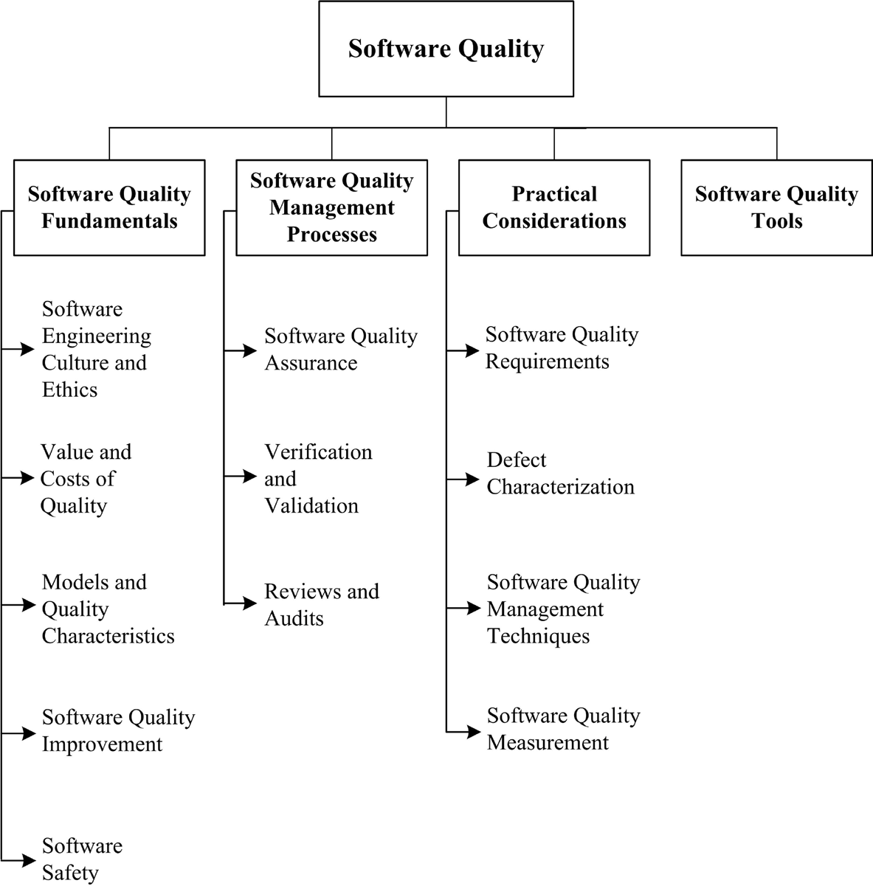

[Home](index.md)
## Welcome to Software Quality

Software quality may refer: to desirable characteristics of software products, to the extent to which a particular software product possess those characteristics, and to processes, tools, and techniques used to achieve those characteristics. Over the years, authors and organizations have defined the term quality differently. To Phil Crosby, it was “conformance to requirements”. Watts Humphrey refers to it as “achieving excellent levels of “fitness for use”. Meanwhile, IBM coined the phrase “market-driven quality,” where the “customer is the final arbiter”.

More recently, software quality is defined as the “capability of software product to satisfy stated and implied needs under specified conditions” and as “the degree to which a software product meets established requirements; however, quality depends upon the degree to which those established requirements accurately represent stakeholder needs, wants, and expectations”. Both definitions embrace the premise of conformance to requirements. Neither refers to types of requirements (e.g., functional, reliability, performance, dependability, or any other characteristic). Significantly, however, these definitions emphasize that quality is dependent upon requirements.

These definitions also illustrate another reason for the prevalence of software quality: a frequent ambiguity of software quality versus software quality requirements (“the -ilities” is a common shorthand). Software quality requirements are actually attributes of (or constraints on) functional requirements (what the system does). Software requirements may also specify resource usage, a communication protocol, or many other characteristics.Software quality is achieved by conformance to all requirements regardless of what characteristic is specified or how requirements are grouped or named.

*Source: [SWEBOK V3](https://www.computer.org/web/swebok/v3)*

### Knowledge and Skills

*Source: [SWEBOK V3](https://www.computer.org/web/swebok/v3)*

### Possible Roles

- [Software Quality Engineer](https://www.softwareengineerinsider.com/careers/software-quality-engineering.html)
- [Software Quality Assurance Engineer](https://www.sokanu.com/careers/software-quality-assurance-engineer/)
- [Software Quality Analyst](https://en.wikipedia.org/wiki/Software_quality_analyst)

### How To

- [How to become a Software Quality Assurance Engineer](https://www.sokanu.com/careers/software-quality-assurance-engineer/how-to-become/)
- [The Path to Becoming a QA Engineer](https://www.paysa.com/blog/2016/12/23/the-path-to-becoming-a-qa-engineer/)

### Professional Certifications

- [The International Software Certifications Board’s (ISCB) Certifications](http://www.softwarecertifications.org/process/software-certifications-overview/)
- [Software Quality Engineer Certification (CSQE)](https://asq.org/cert/software-quality-engineer)

### Community of Interest

- [StickyMinds](https://www.stickyminds.com/)
- LinkedIn Groups:
  - [Software Quality Engineers](https://www.linkedin.com/groups/10332028)
  - [Software Quality Assurance Leadership Networking Group](https://www.linkedin.com/groups/1779934/profile)
  - [Software Quality (2967339)](https://www.linkedin.com/groups/2967339/profile)

### Blogs

- [TechBeacon - Quality](https://techbeacon.com/quality)
- [QA Mentor’s Wisdom Center](http://www.qamentor.com/wisdom-center/)
- [QABlogs.net](http://www.qablogs.net/)

### Market Insights

- [Software Quality Assurance - Members](https://www.linkedin.com/title/software-quality-assurance)
- [Software Quality Assurance - Topic](https://www.linkedin.com/topic/software-quality-assurance)
- [Software Quality Control](https://www.linkedin.com/topic/software-quality-control)
- [Software Quality Management](https://www.linkedin.com/topic/software-quality-management)

### Resources Collections

- [SQGNE - The Software Quality Page](http://www.sqgne.org/links.html)
- [135 Software Quality Assurance Tips, Tools, Tutorials, Blogs and Resources](http://www.computersciencezone.org/software-quality-assurance/)

## Learning Resources

**Important Note:** *all learning resources available here are free. If you found any learning resource that requires a fee or the URL is broken/wrong, please [inform us](https://github.com/ayshahrah/seg/issues). Regarding the MOOCs that are bundled as a specialization track with a fee (e.g. coursera's specializations and edx's xseries programs), you can look for each individual course and take it for free (Audit option).*

### Foundation

#### MOOCs

- [Learning How to Learn](https://www.coursera.org/learn/learning-how-to-learn)
- [Mindshift](https://www.coursera.org/learn/mindshift)
- [Software Development Process](https://www.udacity.com/course/software-development-process--ud805)
- [Software Engineering Essentials](https://www.edx.org/course/software-engineering-essentials-tumx-seecx-0)
- [Software Engineering: Introduction](https://www.edx.org/course/software-engineering-introduction-ubcx-softeng1x)
- **[Soft Skills](ss.md)**

#### Webinars

- [Implementing Software Quality Assurance Best Practices](https://intland.com/webinar-recording/implementing-software-quality-assurance-best-practices/)

#### Others

- Read the Chapter 10: Software Quality in [SWEBOK V3](https://www.computer.org/web/swebok/v3)

### Beginner

#### MOOCs

- [Software Testing](https://www.udacity.com/course/software-testing--cs258)
- [Software Testing and Verification](https://www.edx.org/micromasters/software-testing-verification)

#### Webinars

- [A Pragmatic Approach to Software Quality Management](http://info.programmingresearch.com/pragmatic-software-quality-management-awareness-lp)
- [Software Quality Management A Proactive Approach](https://www.youtube.com/watch?v=2INJvl8r1eE)
- [Conquering Software Quality Metrics](https://www.youtube.com/watch?v=hwsSEJYtmgs)
- [PNSQC Trends in Software Quality](http://tvfortesters.com/video/pnsqc-trends-in-software-quality-webinar/)
- [How to Deliver High-Quality Software On Time](https://www.vectorcast.com/news/vector-software-events/2016/webinar-how-deliver-high-quality-software-time-0)
- [XBOSOFT Quality Management Webinar Archives](https://xbosoft.com/category/webinars/quality-management/)
- [QA Webinars](http://qaiusa.com/webinars/)
- [Stickyminds Web Seminars](https://www.stickyminds.com/web-seminars)
- [QAI Canada Webinars](http://www.qaicanada.org/webinars/)

#### Others

- [Software quality challenges and practice recommendations](http://www.ibm.com/developerworks/rational/library/software-quality-challenges-practice-recommendations/)
- [The Ultimate Guide to Measuring Software Quality](http://intetics.com/white-papers/the-ultimate-guide-to-measuring-software-quality/)
- [SQA Definition](http://www.sqa.net/)

### Intermediate

#### MOOCs

- [Software Development Lifecycle](https://www.coursera.org/specializations/software-development-lifecycle)
- [Agile Development](https://www.coursera.org/specializations/agile-development)
- [Agile Software Development](https://www.edx.org/course/agile-software-development-ethx-asd-1x)

#### Webinars

- [Agile Development Basics](http://info.versionone.com/Agile-Development-Basics-Webinar.html)
- [Better, Faster, and Easier: Agile Application Development for Your Business](http://www.appian.com/resources/better-faster-and-easier-agile-application-development-for-your-business/)
- [Watch the Do Agile Right webinar](http://blogs.atlassian.com/2014/02/watch-agile-right-webinar-lessons-learned-atlassian-software-engineer/)
- [How to deliver quality assurance at speed](https://www.atlassian.com/agile/how-to-deliver-quality-assurance-at-speed-video)
- [Boosting Software Quality and Development Agility](https://www-01.ibm.com/marketing/iwm/iwm/web/signup.do?source=dw-c-wcsdpr&S_PKG=500020907)

#### Others

- [Agile for Dummies](https://www-01.ibm.com/marketing/iwm/dre/signup?source=mrs-form-334&S_PKG=ov3282)
- [Agile Skills Learning Circle Wiki](https://www.ibm.com/developerworks/community/wikis/home/wiki/W61b873bae705_4dcd_aa9b_fe8380d4d7fb?lang=en)
- [Agile Methodology](https://www.cigital.com/knowledge-database/agile-methodology/)
- [Agile Alliance](https://www.agilealliance.org/)
- [The Agile Coach](https://www.atlassian.com/agile)
- [Getting Started or Simply Scaling Agile?](https://www.versionone.com/resources/)
- [A Practical Guide: Product Management & Agile Development](http://web.accompa.com/white-paper-product-management-agile-development/)
- [SMARTBEAR's ebooks](https://smartbear.com/resources/ebooks/?page=1)
- [Evidence of software quality in Agile development environments](http://searchsoftwarequality.techtarget.com/answer/Evidence-of-software-quality-in-Agile-development-environments)
- [Agile Testing and Quality Strategies: Discipline Over Rhetoric](http://www.ambysoft.com/essays/agileTesting.html#AgileQualityStrategies)
- [Top 5 software quality metrics that matter right now](https://techbeacon.com/top-5-software-quality-metrics-matter-right-now)
- [Agile Software Development Quality assurance best practices](https://www.cegeka.com/cz/cs/ebooks/agile-software-development--quality-assurance-best-practices)
- [AgileConnection.com](https://www.agileconnection.com/)
- [Scrum Guide](http://www.scrumguides.org/)
- [CMCrossroads.com](https://www.cmcrossroads.com/)
- [ALM Body of Knowledge](http://www.almbok.com/start)
- [Application lifecycle management tools: A buyer's guide to ALM software](http://searchsoftwarequality.techtarget.com/buyersguide/Application-lifecycle-management-tools-A-buyers-guide-to-ALM-software)
- [Software Development Trends and Benchmarks](https://www.atlassian.com/whitepapers/software-trends-2016)

### Advanced

#### MOOCs

- [Industry 4.0: How to Revolutionize your Business](https://www.edx.org/course/industry-4-0-how-revolutionize-business-hkpolyux-i4-0x)
- [Emerging Technologies: From Smartphones to IoT to Big Data Specialization](https://www.coursera.org/specializations/emerging-technologies)
- [Internet of Things](https://www.coursera.org/specializations/internet-of-things)
- [The Internet of Things](https://www.futurelearn.com/courses/internet-of-things)
- [Unpacking the Internet of Things (IoT)](https://www.udemy.com/unpacking-the-internet-of-things/)
- [A Simple Framework for Designing IoT Products](https://www.udemy.com/a-simple-framework-for-designing-iot-products/)
- [New Business Markets in the Internet of Things (IoT)](https://www.udemy.com/new-business-markets-in-iot/)
- [Cloud Computing](https://www.coursera.org/specializations/cloud-computing)
- [Intro to DevOps](https://www.udacity.com/course/intro-to-devops--ud611)
- [Microsoft Professional Program - DevOps](https://academy.microsoft.com/en-us/professional-program/tracks/devops/)
- **[Entrepreneurship Skills](es.md)**

#### Webinars

- [DevOps QA webinar: Unboxing Improved Speed and Quality](https://techwave.net/devops-qa-unboxing-improved-speed-and-quality/)
- [Introducing the Next Generation of ALM](https://www.brighttalk.com/webcast/8653/197515)
- [Modern Application Development Life Cycle Management](https://www.gartner.com/webinar/2998618)
- [Orasi Webinars](http://www.orasi.com/recorded-events/)
- [VersionOne Webinars](https://www.versionone.com/resources/webinars/)
- [Internet of Things Webinar Series](https://www.mongodb.com/lp/webinar-series/internet-of-things)

#### Others

- [Why Software Quality Standards Matter For Industrial IoT](http://www.informationweek.com/devops/why-software-quality-standards-matter-for-industrial-iot/a/d-id/1326253)
- [Software Quality and the Industrial Internet of Things: Why it Matters NOW](http://eecatalog.com/IoT/2015/07/06/software-quality-and-the-industrial-internet-of-things-why-it-matters-now/)
- [Software Quality and Industry 4.0: The Industrial Internet of Things](https://dzone.com/articles/software-quality-and-industry-40-the-industrial-in)
- [The Function of Quality Assurance (QA) with the Internet of Things](https://www.ctl.io/blog/post/qa-with-the-iot/)
- [DevOps For Dummies](http://www.ibm.com/ibm/devops/us/en/resources/dummiesbooks/)
- [The Ultimate DevOps Toolkit](https://www.appdynamics.com/lp/devops-toolkit/)
- [DevOps.com](https://devops.com/)
- [Roles and Responsibilities for DevOps and Agile Teams](https://medium.com/@cote/roles-and-responsibilities-for-devops-and-agile-teams-fdacbffb4cb4#.9de94n71e)
- [QA in the DevOps Era](https://devops.com/qa-devops-era/)
- [How DevOps Principles & Practices Improve Software Quality & Efficiency](http://www.gallop.net/blog/devops-principles-practices-improve-software-quality/)
- [What is the Role of QA in the world of DevOps?](http://www.cigniti.com/blog/what-is-the-role-of-qa-in-the-world-of-devops/)
- [Improving software quality means mixing DevOps with Agile](http://www.theserverside.com/tip/Improving-software-quality-means-mixing-DevOps-with-Agile)
- [Improving Software Quality with DevOps and Continuous Software Development](http://www.bitpipe.com/detail/RES/1482335367_809.html)
- [XebiaLabs Resource Library](https://xebialabs.com/resources/)
- [Scaled Agile Framework (SAFe®) in a nutshell](https://intland.com/blog/agile/safe/scaled-agile-framework-safe-in-a-nutshell/)
- [Doing Scrum with Multiple Teams: Comparing Scaling Frameworks](https://www.infoq.com/articles/scrum-multiple-teams-frameworks)
- [TechBeacon](https://techbeacon.com/)
- [TradePub.com](https://sf.tradepub.com/)
