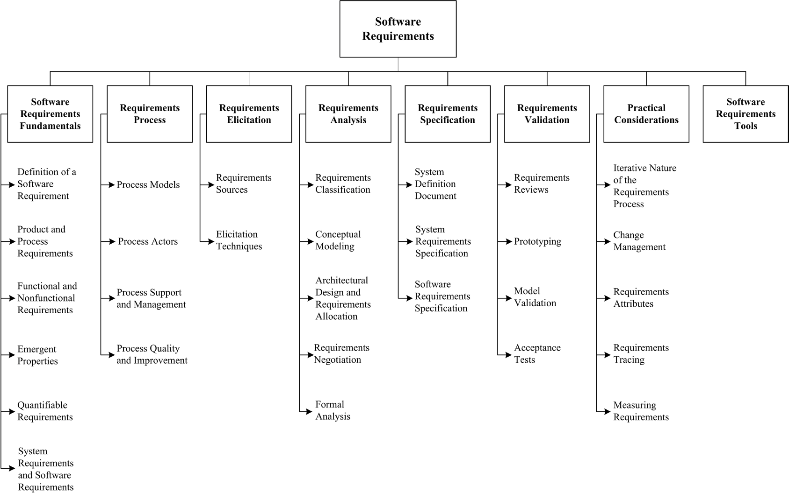

[Home](index.md)
## Welcome to Software Requirements

The Software Requirements is concerned with the elicitation, analysis, specification, and validation of software requirements as well as the management of requirements during the whole life cycle of the software product. It is widely acknowledged amongst researchers and industry practitioners that software projects are critically vulnerable when the requirements related activities are poorly performed.

Software requirements express the needs and constraints placed on a software product that contribute to the solution of some real-world problem. The term “requirements engineering” is widely used in the field to denote the systematic handling of requirements.

The Software Requirements are related closely to the Software Design, Software Testing, Software Maintenance, Software Configuration Management, Software Engineering Management, Software Engineering Process, Software Engineering Models and Methods, and Software
Quality.

*Source: [SWEBOK V3](https://www.computer.org/web/swebok/v3)*

### Knowledge and Skills

*Source: [SWEBOK V3](https://www.computer.org/web/swebok/v3)*

### Possible Roles

- [Software Requirements Engineer](https://en.wikipedia.org/wiki/Requirements_engineering)
- [Software Requirements Analyst](https://en.wikipedia.org/wiki/Requirements_analysis)
- [Computer Systems Analyst](https://www.sokanu.com/careers/computer-systems-analyst/)
- [Business Analyst](https://www.sokanu.com/careers/business-analyst/)
- [Business System Analyst](https://www.iiba.org/Careers/Careers/understanding-the-s-in-business-systems-analysis.aspx)

### How To

- [How to become a business analyst](https://www.discoverdatascience.org/career-information/business-analyst/)
- [Becoming a Business Analyst](http://www.iiba.org/Careers/Becoming-a-Business-Analyst.aspx)
- [42 Reasons To Start a Business Analyst Career](http://www.bridging-the-gap.com/42-reasons-to-consider-starting-a-business-analyst-career/)

### Professional Certifications

- [Certified Professional for Requirements Engineering (CPRE)](https://www.ireb.org/en/cpre/)
- [International Institute of Business Analysis (IIBA) Certifications](http://www.iiba.org/Certification-Recognition.aspx)
- [PMI Professional in Business Analysis (PMI-PBA)](https://www.pmi.org/certifications/types/business-analysis-pba)
- [British Computer Society (BCS) Certifications](http://certifications.bcs.org/category/15680)

### Community of Interest

- [Modernanalyst.com](http://www.modernanalyst.com/Home.aspx)
- LinkedIn Groups:
  - [Software Requirements Engineers](https://www.linkedin.com/groups/10326019)
  - [Requirements Engineering Specialist Group (RESG)](https://www.linkedin.com/groups/2662234/profile)
  - [Requirements Management and Analysis](https://www.linkedin.com/groups/144346/profile)
  - [IIBA (International Institute of Business Analysis)](https://www.linkedin.com/groups/92583/profile)

### Blogs

- [Top Business Analyst Websites and Blogs to Follow](https://businessanalystlearnings.com/blog/2013/1/12/top-6-business-analyst-websites-and-blogs-to-follow)
- [19 must-read business analysis blogs and websites](http://www.businessanalyststoolkit.com/business-analysis-blogs/)

### Market Insights

- [Software Requirements](https://www.linkedin.com/topic/software-requirements)
- [Requirements Management](https://www.linkedin.com/topic/requirements-management)
- [Business Analyst](https://www.linkedin.com/title/business-analyst)
- [Business Analysis](https://www.linkedin.com/topic/business-analysis#definition)
- [Requirements Analysis](https://www.linkedin.com/topic/business-requirements?trk=sushi_topic_insights_name)
- [Systems Analysis](https://www.linkedin.com/topic/systems-analysis#definition)

### Resources Collections

- [A List of Free Business Analyst Training Online](https://businessanalystlearnings.com/blog/2013/1/20/a-list-of-free-business-analyst-training-online)
- [Free courses for business analysts](https://businessanalystlearnings.com/free-courses-for-business-analysts/)

## Learning Resources

**Important Note:** *all learning resources available here are free. If you found any learning resource that requires a fee or the URL is broken/wrong, please [inform us](https://github.com/ayshahrah/seg/issues). Regarding the MOOCs that are bundled as a specialization track with a fee (e.g. coursera's specializations and edx's xseries programs), you can look for each individual course and take it for free (Audit option).*

### Foundation

#### MOOCs

- [Learning How to Learn](https://www.coursera.org/learn/learning-how-to-learn)
- [Mindshift](https://www.coursera.org/learn/mindshift)
- [Software Development Process](https://www.udacity.com/course/software-development-process--ud805)
- [Software Engineering Essentials](https://www.edx.org/course/software-engineering-essentials-tumx-seecx-0)
- [Software Engineering: Introduction](https://www.edx.org/course/software-engineering-introduction-ubcx-softeng1x)
- **[Soft Skills](ss.md)**

#### Webinars

- [The Business Analyst Catalyst: The Role of the BA in Today's Business World](https://www.youtube.com/watch?v=n_39RcB9UyY)
- [From Waterfall to Agile - A Business Analyst's Survival Guide](https://www.youtube.com/watch?v=UVqmbpIQXkw)
- [Myth Busting the role of the Business Analyst](https://www.youtube.com/watch?v=VmYdtWYwZDY)

#### Others

- Read the Chapter 1: Software Requirements in [SWEBOK V3](https://www.computer.org/web/swebok/v3)

### Beginner

#### MOOCs

- [Software Product Management](https://www.coursera.org/learn/client-needs-and-software-requirements)
- [Requirements Engineering: Secure Software Specifications](https://www.coursera.org/specializations/requirements-engineering-secure-software)

#### Webinars

- [How to Write Good Requirements](http://www.jamasoftware.com/resource/webinar-write-good-requirements/)
- [Requirements Management Best Practices](https://www.youtube.com/watch?v=7vx6RDydAPo)
- [5 Best Practices to Define, Approve and Manage Requirements Throughout the Lifecycle](http://content.intland.com/webinar/5-best-practices-to-define-approve-and-manage-requirements-throughout-the-lifecycle)
- [Software Requirements: 7 Critical Success Factors](http://www.modernanalyst.com/Webinars/tabid/207/articleType/ArticleView/articleId/2525/Software-Requirements-7-Critical-Success-Factors.aspx)
- [Software Requirements: 10 Traps to Avoid](https://www.youtube.com/watch?v=MtOcFwWUEPc)
- [IIBA's BABOK Guide and PMI's Business Analysis for Practitioners Guide](https://www.youtube.com/watch?v=45Bqb9rhdiY)
- [A List of Free Business Analysis Webinars](https://businessanalystlearnings.com/blog/2015/11/28/a-list-of-free-business-analysis-webinars)

#### Others

- [Requirements Definition and Management for Dummies](http://www.blueprintsys.com/content/ebook-requirements-definition-and-management-for-dummies/)
- [A List of Free Ebooks & White Papers For Business Analysts](https://businessanalystlearnings.com/blog/2014/12/5/a-list-of-free-ebooks-white-papers-for-business-analysts)
- [Requirements Management Guide](https://intland.com/guides-brochures/guides/requirements-management-guide-2/)
- [Managing Your Requirements](https://www.ibm.com/developerworks/community/blogs/requirementsmanagement/entry/why-requirements-management?lang=en)
- [Converging 360](https://rmcls.com/360/)

### Intermediate

#### MOOCs

- [Software Development Lifecycle](https://www.coursera.org/specializations/software-development-lifecycle)
- [Agile Development](https://www.coursera.org/specializations/agile-development)
- [Agile Software Development](https://www.edx.org/course/agile-software-development-ethx-asd-1x)

#### Webinars

- [Agile Development Basics](http://info.versionone.com/Agile-Development-Basics-Webinar.html)
- [Better, Faster, and Easier: Agile Application Development for Your Business](http://www.appian.com/resources/better-faster-and-easier-agile-application-development-for-your-business/)
- [Watch the Do Agile Right webinar](http://blogs.atlassian.com/2014/02/watch-agile-right-webinar-lessons-learned-atlassian-software-engineer/)
- [It’s an Agile World: Requirements at the Speed of Thought](http://www.modernanalyst.com/Webinars/tabid/207/ID/3650/Its-an-Agile-World-Requirements-at-the-Speed-of-Thought.aspx)
- [Agile Requirements Not an Oxymoron](https://www.youtube.com/watch?v=VYQ88YG8osw&feature=youtu.be)
- [Agile Requirements Management Best Practices](https://www.youtube.com/watch?v=HQizMS04A7s)
- [Agile Requirements - Visual Modeling Techniques](https://www.youtube.com/watch?v=Y_-f2CZELrw)
- [Use Cases and User Stories for Agile Requirements](https://www.youtube.com/watch?v=NB2ZB6DOrlM)
- [Being Agile with Atlassian 2 of 5: Agile Requirements Management](https://www.youtube.com/watch?v=VYQ88YG8osw&feature=youtu.be)
- [BA Agile Webinars](https://www.batimes.com/agile/webinars.html)

#### Others

- [Agile for Dummies](https://www-01.ibm.com/marketing/iwm/dre/signup?source=mrs-form-334&S_PKG=ov3282)
- [Agile Skills Learning Circle Wiki](https://www.ibm.com/developerworks/community/wikis/home/wiki/W61b873bae705_4dcd_aa9b_fe8380d4d7fb?lang=en)
- [Agile Methodology](https://www.cigital.com/knowledge-database/agile-methodology/)
- [Agile Alliance](https://www.agilealliance.org/)
- [The Agile Coach](https://www.atlassian.com/agile)
- [Getting Started or Simply Scaling Agile?](https://www.versionone.com/resources/)
- [A Practical Guide: Product Management & Agile Development](http://web.accompa.com/white-paper-product-management-agile-development/)
- [Enterprise Agile Requirements For Dummies](http://www.blueprintsys.com/content/ebook-enterprise-agile-requirements-for-dummies/)
- [A Practical Guide: Business Analysts & Agile Development](http://web.accompa.com/white-paper-business-analysis-agile-development/)
- [Creating a lean, mean product requirements machine](https://www.atlassian.com/agile/requirements)
- [Breakout Vendors: Agile Requirements Management](http://www.blueprintsys.com/content/forrester-breakout-vendors-agile-requirements)
- [The role of the Business Analyst in Agile Projects](https://blog.valbonne-consulting.com/2015/10/31/the-role-of-the-business-analyst-in-agile-projects/)
- [Role of Business Analysis in Agile](https://www.infoq.com/news/2016/03/business-analysis-agile)
- [Forrester: Modern Software Requirements](https://software.microfocus.com/en-us/assets/application-delivery-management/forrester-modern-software-requirements)
- [The Top Three Application Lifecycle Management Tools For SMBs](http://www.softwareadvice.com/resources/application-lifecycle-management-tools/)
- [Market Guide for Requirements Management Solutions](https://www.blueprintsys.com/content/market-guide-software-requirements-management-solutions/)
- [AgileConnection.com](https://www.agileconnection.com/)
- [Scrum Guide](http://www.scrumguides.org/)
- [CMCrossroads.com](https://www.cmcrossroads.com/)
- [ALM Body of Knowledge](http://www.almbok.com/start)
- [Application lifecycle management tools: A buyer's guide to ALM software](http://searchsoftwarequality.techtarget.com/buyersguide/Application-lifecycle-management-tools-A-buyers-guide-to-ALM-software)
- [Software Development Trends and Benchmarks](https://www.atlassian.com/whitepapers/software-trends-2016)

### Advanced

#### MOOCs

- [Industry 4.0: How to Revolutionize your Business](https://www.edx.org/course/industry-4-0-how-revolutionize-business-hkpolyux-i4-0x)
- [Emerging Technologies: From Smartphones to IoT to Big Data Specialization](https://www.coursera.org/specializations/emerging-technologies)
- [Internet of Things](https://www.coursera.org/specializations/internet-of-things)
- [The Internet of Things](https://www.futurelearn.com/courses/internet-of-things)
- [Unpacking the Internet of Things (IoT)](https://www.udemy.com/unpacking-the-internet-of-things/)
- [A Simple Framework for Designing IoT Products](https://www.udemy.com/a-simple-framework-for-designing-iot-products/)
- [New Business Markets in the Internet of Things (IoT)](https://www.udemy.com/new-business-markets-in-iot/)
- [Cloud Computing](https://www.coursera.org/specializations/cloud-computing)
- [Intro to DevOps](https://www.udacity.com/course/intro-to-devops--ud611)
- [Microsoft Professional Program - DevOps](https://academy.microsoft.com/en-us/professional-program/tracks/devops/)
- **[Entrepreneurship Skills](es.md)**

#### Webinars

- [Introducing the Next Generation of ALM](https://www.brighttalk.com/webcast/8653/197515)
- [Modern Application Development Life Cycle Management](https://www.gartner.com/webinar/2998618)
- [Demand – Requirement – DevOps: From Idea to Implementation](https://intland.com/webinar-recording/demand-requirement-devops-from-idea-to-implementation/)
- [SAFe & Requirements Management: Oxymoron or Practical Reality?](https://www.youtube.com/watch?v=uaLNRiT0I9c)
- [VersionOne Webinars](https://www.versionone.com/resources/webinars/)

#### Others

- [Agile Requirements Frameworks](http://makingofsoftware.com/2014/agile-requirements-frameworks)
- [DevOps For Dummies](http://www.ibm.com/ibm/devops/us/en/resources/dummiesbooks/)
- [The Ultimate DevOps Toolkit](https://www.appdynamics.com/lp/devops-toolkit/)
- [DevOps.com](https://devops.com/)
- [Roles and Responsibilities for DevOps and Agile Teams](https://medium.com/@cote/roles-and-responsibilities-for-devops-and-agile-teams-fdacbffb4cb4#.9de94n71e)
- [The Relationship Between DevOps and Requirements](https://www.blueprintsys.com/blog/the-relationship-between-devops-and-requirements/)
- [How Continuous Requirements Are Key to Gartner’s DevOps Toolchain](http://www.blueprintsys.com/blueprint-devops/)
- [Requirements Management in IoT-enabled Systems Development](https://intland.com/blog/requirements/requirements-management-in-iot-enabled-systems-development/)
- [When DevOps and requirements gathering techniques collide](http://searchsoftwarequality.techtarget.com/tip/When-DevOps-and-requirements-gathering-techniques-collide)
- [Continuous Delivery Cannot Succeed Without Business Analysts](https://www.thoughtworks.com/insights/blog/continuous-delivery-cannot-succeed-without-business-analysts)
- [XebiaLabs Resource Library](https://xebialabs.com/resources/)
- [Scaled Agile Framework (SAFe®) in a nutshell](https://intland.com/blog/agile/safe/scaled-agile-framework-safe-in-a-nutshell/)
- [Doing Scrum with Multiple Teams: Comparing Scaling Frameworks](https://www.infoq.com/articles/scrum-multiple-teams-frameworks)
- [TechBeacon](https://techbeacon.com/)
- [TradePub.com](https://sf.tradepub.com/)
